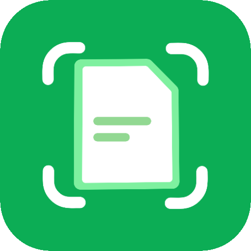

<p align="center">
  
</p>

<h1 align="center">FairScan</h1>

<p align="center">
  Scan your documents —
<br/><b>simple</b> and <b>respectful</b>.
<br/><b>Android</b> app · <b>Windows</b> desktop app
</p>

<p align="center">
  <a href="https://github.com/pynicolas/FairScan/releases"></a>
  <a href="LICENSE"></a>
</p>
<h3 align="center">
  <b>Get it on:</b>
  <a href="https://f-droid.org/en/packages/org.fairscan.app/">F-Droid</a> ·
  <a href="https://play.google.com/store/apps/details?id=org.fairscan.app">Google Play</a> ·
  <a href="https://github.com/pynicolas/FairScan/releases">GitHub</a>
</h3>

---

FairScan is a document scanner for **Android and Windows** — it lets you **scan documents quickly, easily and privately**.

It's designed to be **simple**: users get a clean, shareable PDF in seconds, with no manual adjustments.<br>
And **respectful**: open source, minimal permissions, no tracking, no ads.

This project was **refactored from the Android app into a Windows desktop version** — the image-processing
pipeline is shared between both platforms, so Android and Windows behave identically.

- Website: https://fairscan.org  
- Blog: https://fairscan.org/blog/

> **Note on the Android app:** the Android source is kept in this repository (with the upstream build
> configuration preserved), but it may **not compile out-of-the-box** — it requires a specific Android SDK
> toolchain (e.g. JDK 17 + a compatible AGP/Android Gradle setup) and may need additional configuration.
> The project is primarily maintained as the **Windows desktop version**; the shared `imageprocessing`
> module is the same code used on both platforms.

---

## Windows desktop version

In addition to the original Android app, this repository contains a refactored **Windows desktop version**:

- The shared **image processing pipeline** (Kotlin + OpenCV) runs unchanged on the JVM
  through a lightweight **CLI kernel** (`desktop/`)
- A **native-feeling UI** built with **Electron** (`desktop/ui/`), featuring an acrylic/glass window,
  custom icon, drag-and-drop, and full scan / preview / OCR / PDF export flow
- Ships as **NSIS installer** and **portable executable**, with an embedded minimal **JRE** and all models
- **Windows 7 SP1 compatible** parallel build (`desktop/ui-win7/`), pinned to the last Win7-supported
  versions of Electron (22.x) and ONNX Runtime (1.14.x)

Beyond the Android features, the desktop version adds:

- **Automatic orientation detection** (PP-LCNet doc_ori model, 0/90/180/270)
- **Document unwarping** for curved pages (UVDoc grid-based model)
- **Multi-document detection** (multiple pages per photo)
- **Shadow removal** and alternate segmentation models (e.g. u2netp)
- **Batch scanning** of files and folders from the command line

Build the desktop version:

```bash
# JVM kernel (JDK 11)
./gradlew -p desktop installDist

# Electron UI
cd desktop/ui && npm install && npm run dist
```

> **Note:** for a Windows 7 SP1 compatible build, run the same steps in `desktop/ui-win7` instead of `desktop/ui` (it is pinned to Electron 22.x and ONNX Runtime 1.14.x).

---

## Contributing

Contributions are welcome, but please read the guidelines first: [CONTRIBUTING.md](CONTRIBUTING.md)

---

## Translations

Translations are managed on Weblate, and everyone is welcome to contribute.

[](https://hosted.weblate.org/engage/fairscan/)

Start translating:
https://hosted.weblate.org/projects/fairscan/

---

## Features

- **Clear, distraction-free interface**
- **Easy flow**: scan, review if needed, save or share
- **Automatic document detection** using a custom segmentation model
- **Automatic perspective correction**
- **Automatic image enhancement**
- **Fast PDF generation** with no manual adjustments
- **All document processing happens locally on your device**, no cloud processing
- **Minimal permissions**
- **Open source**, GPLv3

---

## What FairScan is not

FairScan is **not** intended to:
- provide fine-grained manual control over document processing
- replicate all features found in other scanning apps
- optimize for highly specific use cases at the expense of simplicity
 
---

## Compatibility

The **Android** app works on any device that:
- runs **Android 8.0+**
- has a camera

The **Windows desktop** app works on:
- **Windows 7 SP1** (parallel `ui-win7` build) or **Windows 10 / 11** (default build)
- x64

---

## Experimental: Scan to PDF via intent

FairScan can be invoked by other Android applications to perform a document scan and return a generated PDF.

This feature is **experimental** and intended for developers who want to rely on FairScan as a
simple, privacy-respecting scanning tool.
The intent contract and behavior may change between versions, and backward compatibility
is not guaranteed at this stage.

Intent action: `org.fairscan.app.action.SCAN_TO_PDF`

This is an **implicit intent** that launches FairScan in a dedicated external mode.

When started via this intent:

- FairScan opens directly in scan mode
- the user scans one or more pages
- FairScan generates a single PDF
- the resulting PDF is returned to the calling application as a URI with a limited lifetime
- the calling application should immediately copy the content of the URI as FairScan deletes it later

See an example app: [fairscan-intent-sample](https://github.com/pynicolas/fairscan-intent-sample)

---

## Technical details

The Android app uses:

- [Jetpack Compose](https://developer.android.com/compose) for the UI
- [CameraX](https://developer.android.com/media/camera/camerax) for image capture
- [LiteRT](https://ai.google.dev/edge/litert) to run the custom segmentation model for automatic document detection
- [OpenCV](https://opencv.org/) for perspective correction and image enhancement
- [Tesseract](https://github.com/tesseract-ocr/tesseract) for text recognition (OCR)
- [PDFBox-Android](https://github.com/TomRoush/PdfBox-Android) for PDF generation

The Windows desktop version reuses the same image-processing pipeline on the JVM, and adds:

- [Electron](https://www.electronjs.org/) for the desktop UI
- [ONNX Runtime](https://onnxruntime.ai/) for the additional models (orientation, unwarping, segmentation)
- [Tess4J](https://github.com/nguyenq/tess4j) (Tesseract) for OCR
- [PDFBox](https://pdfbox.apache.org/) for PDF generation

---

## The segmentation model

FairScan uses a custom-trained image segmentation model to detect documents:<br>
https://github.com/pynicolas/fairscan-segmentation-model

It's based on a fully public dataset that is available here:<br>
https://github.com/pynicolas/fairscan-dataset

The build system automatically downloads the model using  
[`download-tflite.gradle.kts`](app/download-tflite.gradle.kts).

Related blog posts:
- [*Making document detection more reliable*](https://fairscan.org/blog/automatic-document-detection/)
- [*Building a public dataset for FairScan*](https://fairscan.org/blog/building_a_public_dataset/)

---

## Build

To build an APK:

```bash
./gradlew clean check assembleRelease
```
To build an Android App Bundle:
```bash
./gradlew clean check :app:bundleRelease
```

## License
This project is licensed under the GNU GPLv3. See [LICENSE](LICENSE) for details.
